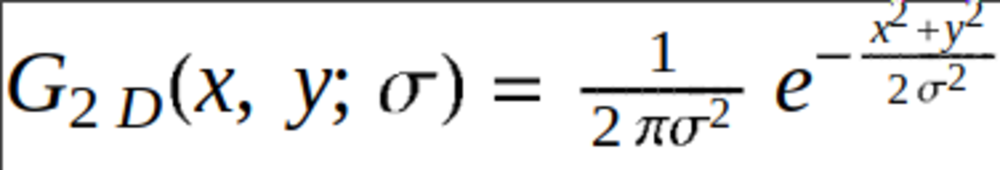

# :sunrise_over_mountains: Image Convoluter
This program convolutes images. It is is meant as a demonstrative example of two
theoretical concepts:
  - Discrete Kernel
  - Convolution

Generally speaking these methods are used by renderers to make images be more
appealing to the viewer, but the same techniques can be applied to an image to
make it more blurry.

## :corn: Supported Kernels
  - Gaussian
  - Uniform

The Gaussian kernel can be expressed as:

where the domain of i and j are [-R, R] for some radius R of the kernel and some
standard deviation sigma.

The Uniform kernel can be expressed as: 1/k for all i and j in domain [-R, R]
for some uniform constant k.

## :mag_right: Examples
### Gaussian Applied to png
The following is an image generated with the [Erdos Renyi random graph
generator](https://github.com/millipedes/Erdos-Renyi-Visualization) with some
particular parameters written by millipedes.

The following convolution parameters were applied:
  - 15 convolutions
  - Gaussian Kernel
  - 3 Radius Kernel (i.e. 7x7)
  - Sigma = 0.84089642
  - png file format

this is the resulting image:

### Gaussian Applied to netpbm
The `figures/test_in.ppm` is an image generated with the [C Graphing
tool](https://github.com/millipedes/C-Netpbm-Function-Grapher)
written by millipedes.

Unfortunately git does not have a .ppm displayer but you can find that file in
this repo.

The following convolution parameters were applied:
  - 15 convolutions
  - Gaussian Kernel
  - 3 Radius Kernel (i.e. 7x7)
  - Sigma = 0.84089642
  - ppm (subset of netpbm) file format

this is the resulting image: `figures/test_out.ppm`.
